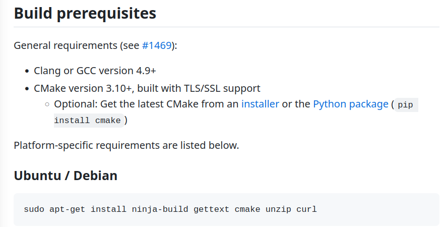

# 介绍

Neovim是一个基于Vim的超可扩展文本编辑器，Neovim 是 Vim 的一个雄心勃勃的重构。主要目标是：重构代码以改善维护；实施新的高级功能；展示一个更好、更强大的插件系统；开放的开发模式，随时接受贡献，接受的标准也很明确。

Neovim在GitHub上自述为 *Vim-fork focused on extensibility and usability* ，所以自Neovim诞生以来，它就专注于提高自己的扩展性与易用性，例如内置终端、异步执行这两个比较重要的功能都是Neovim率先支持，而Vim追赶在后的。经过多年在各自赛道上的发展，Neovim与Vim已经产生了不少差异。不过现阶段来看， **Neovim的特性仍然几乎是Vim的超集** ，也就是说除了自己独有的功能外，Neovim还支持Vim的绝大部分功能。

# 安装

[neovim wiki](https://github.com/neovim/neovim/wiki) 以下步骤可以在wiki中查看

安装前置包

[https://github.com/neovim/neovim/wiki/Building-Neovim#build-prerequisites](https://github.com/neovim/neovim/wiki/Building-Neovim#build-prerequisites)



```bash
sudo apt-get install ninja-build gettext cmake unzip curl
```

安装ninja否则安装时会提示缺少ninja模块

```bash
pip3 install ninja
sudo pip3 install ninja
```

还需要安装lua，根据提示选择版本

```bash
sudo apt install lua5.1
```

克隆neovim的代码仓库，这里克隆0.9的版本

```bash
git clone git@github.com:neovim/neovim.git -b release-0.9
```

```bash
cd neovim
```

```bash
make CMAKE_BUILD_TYPE=Release
sudo make install
```

## 添加粘贴板

```bash
sudo apt install xclip   
```

使从系统和neovim的剪贴板互通

# 卸载

在克隆的代码下执行一下命令

```
sudo cmake --build build/ --target uninstall
```

# 配置

```bash
git clone git@github.com:chenchongbiao/dotfiles.git ~/.config/dotfiles
```

克隆到指定目录

```bash
cd dotfiles
git submodule init && git submodule update
```

初始化子模块，这里有nvim的配置。

# 指令

## :checkhealth

进行自检，提示需要改进的地方。
