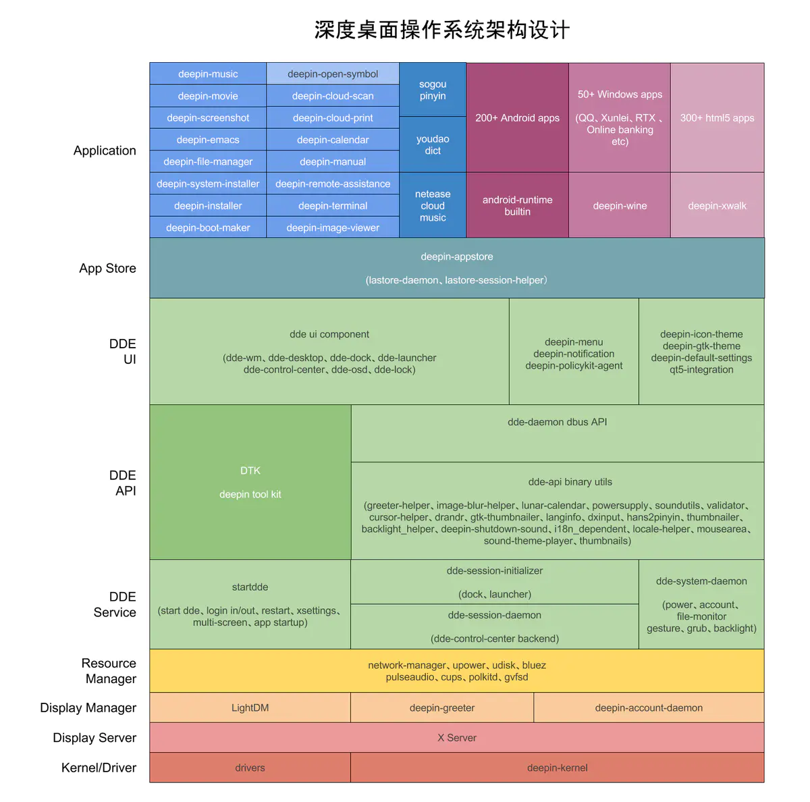
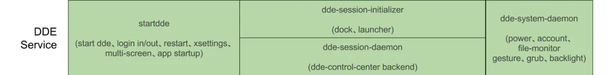
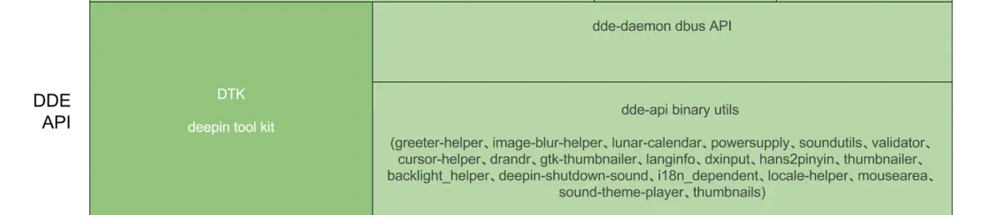
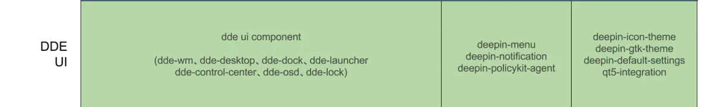

# 操作系统使用编程语言

深度桌面操作系统为例：

* 服务型的后端都用Golang语言: Golang语言能够完美调用大量C语言编写的底层库，同时开发效率和运行效率都俱佳，写出来的程序很少会出错，深度桌面系统的后端主要使用的就是Golang语言来编写的。
* 前端界面主要用 Qt/C++ 来编写，因为Qt相对于Gtk有更好的技术支持、代码质量以及API延续性都要比Gtk+3好很多，深度采用C++来编写包括桌面环境和深度系列应用的前端界面

原链接：[深度桌面操作系统的构架设计](https://www.jianshu.com/p/e871723f9460)

# 什么是桌面环境？

Linux本身没有图形界面，Linux现在的图形界面的实现只是Linux下的应用程序实现的。

桌面环境简单来说，就是在内核和X Server之上，写一批程序让用户登录后就可以直觉性、流畅的使用桌面、任务栏、开始菜单、文件操作和系统设置。

X是协议，不是具体的某个软件就像是HTTP协议，IP协议一样，一个基于X的应用程序需要运行并显示内容时它就接到X服务器，开始用X协议和服务器交谈，比如X应用程序要在屏幕输出一个圆，X应用程序只负责告诉X服务器在屏幕什么地方用什么颜色画一个多圆，而具体的画的动作交给服务器。

# 深度桌面操作系统架构设计



一个完整的桌面系统从技术剖面看，从下到上主要分这几层：

* 内核驱动层：主要是保障硬件的基本功能和兼容性，所有的Linux发行版都大同小异，差别就是内核补丁集不一样，或者集成的驱动和固件多少的差异
* 显示服务层：从内核引导到plymouth(我们俗称的开机动画）后，只要你见到登录界面输入密码的时候，这时候X Server已经起来了， X Server简单来理解就是Linux系统中掌握着绘制图形界面生杀大权的“天神”，所有程序要绘制图形的时候都要发送消息到 X Server, X Server才会给你画出来。同时X Server也是事件输入（键盘鼠标）输出（显示器）的抽象层，开发者可以不用考虑底层驱动和显卡驱动细节，直接就可以使用X11/XCB的API进行应用开发，只不过更多的开发者是使用Gtk+/Qt这些在X11/XCB更上层的API进行应用开发
* 显示管理器：简单的理解就是你看到的登录界面提示你输入密码的那个地方
* 资源管理器：这一层主要由一系列的底层守护程序来监控硬件的状态，并汇报给上层的桌面环境和应用进一步操作，比如常见的就有网络、电源、磁盘、蓝牙、声音、键盘、打印等
* 桌面环境： 以深度桌面环境为例，主要包括桌面环境后台服务和守护进程、桌面环境对外提供图形开发工具库、二进制工具、DBus API服务和桌面环境UI界面层几个部分组成的
* 应用商店：主要提供系统的软件安装、卸载、升级等操作，保证用户可以安全易用的进行软件管理，同时提供了商店的评论和评分等功能
* 应用程序：主要包括深度开发的系列应用、合作开发的国内应用、Android应用、Windows应用和网页应用，为什么在Linux可以直接运行Android和Windows应用？

## 显示管理器


当X Server启动以后，根据系统启动服务的顺序，显示管理器就在 X Server 之后启动，深度系统使用的是由Ubuntu开发的LightDM, 其他主流的显示管理器还有 Gnome 的 GDM 和 KDE 的 KDM, 使用LightDM的原因主要是 LightDM 非常的轻量，不绑定任何桌面环境，而且提供Gtk+、Qt、Html5等各种前端界面的定制接口，非常方便。

显示管理器主要是根据系统中安装的用户的权限对正在登录的用户提供权限认证和多用户切换功能，一旦认证通过后就从 greeter (LightDM 定制的配置接口）中执行下一步启动程序（通常是桌面环境的初始化程序），以显示桌面环境。

除了基本的用户认证、多用户切换、日期和关机功能以外，还会提供：

* 多媒体的控制接口（右下角），方便用户锁屏和切换用户的时候切换音乐和暂停音乐
* 当系统使用多屏幕时，启动和解锁时，会根据用户的鼠标位置切换锁屏主界面
* 在用户输入密码的时候，就直接启动一些系统级的服务，比如电源、账户、亮度等守护程序，这样用户输入密码的过程很多系统服务就加载好了，可以相对于其他桌面环境同等服务缩短30%以上的登录时间

## 桌面环境



当显示管理器认证成功以后，就会调用 greeter 的 exec 参数，深度桌面环境就是 startdde, startdde 从名字看很容易理解，就是启动深度桌面环境的引导程序，为了让深度桌面环境可以正常启动和显示，startdde调用时会执行以下操作：

* 基本的桌面会话管理，比如大家熟知的注销、重启等操作
* 按照 xsettings 主题规范设置整个系统的主题，保证桌面环境以及桌面环境的应用，不论Gtk+还是Qt可以正常的加载用户设置的主题。屏幕DPI设置也是在这个阶段初始化完成的
* 根据 freedesktop 的各种规范，规范应用程序的启动方法, 包括执行 *.desktop 文件的命令，启动提醒等
* 多屏的管理，保障桌面环境在多屏情况下，可以在正常的主屏显示任务栏和桌面程序
* 开机启动服务的顺序管理，比如会优先启动 dde 核心组件， 才运行启动其他应用程序，防止所有开机程序在登录的一瞬间同时启动，而这时候往往很多系统服务（比如DBus) 都还没准备好，大家一团乱抢CPU资源不但无法快速启动，还会导致其他程序都无法启动，想象一下3个人同时挤一个公交车门是什么状态？)  这时候startdde 就是登录后到dde守护进程启动之前的裁判，只有它授权的程序才能启动， 没有授权的都进入暂缓状态，直到更优先的程序启动完毕

startdde 启动以后，首先会启动 dde-session-initializer 这个进程，这个进程的主要目的是提供给任务栏和启动器后台服务，主要包括：

* 任务栏和启动器都有那些常驻程序
* 所有应用程序的启动状态维护
* 应用程序所在工作区和位置的状态维护
* 当前系统中所有安装应用程序的图标、启动状态维护

dde-session-initializer 就相当于任务栏和启动器的后台守护进程，提供了任务栏和启动器的核心功能，如果没有这个程序，我们日常的应用图标点击、开机启动包括程序窗口的切换都无法进行。

dde-session-initializer 本来是 dde-session-daemon 的一部分，为了加快用户的登录到桌面的速度，从 dde-session-daemon 中分离出来，用以加速任务栏和启动器的显示。

dde-session-daemon 和 dde-system-daemon 就是整个桌面操作系统的后台守护程序，这两个进程维护了所有硬件的状态，包括前面说的网络、电源、磁盘、蓝牙、声音、打印、授权、共享文件、键盘鼠标等，相当于对资源管理器的各种守护进程进行了更高层次的代码封装，把面向底层硬件的状态的接口转换成面向用户设计导向的接口。

根据Linux的最小权限划分，又把所有的后台服务分成 dde-session-daemon 和 dde-system-daemon 两个进程，dde-session-daemon 只掌握那些不需要超级权限的功能模块，比如声音、键盘鼠标、日期时区等。dde-system-daemon 掌握那些需要超级权限的功能模块，比如电源、账户、文件操作、亮度等。通过超级权限的不同进程沙箱的划分，保证执行超级权限的进程被限制在最小化的范围，避免因系统权限传导而导致的很多安全事件。

dde-session-daemon 和 dde-system-daemon 做的事情我简单列举一下吧：

* 提供用户的创建、删除和管理功能
* 管理多个屏幕的不同状态，包括位置、方向、分辨率和亮度等
* 管理不同文件类型的默认程序和主题设置
* 管理网络的有线、无线、VPN、DSL等网络设置
* 管理蓝牙、声音、日期、时间时区等设置
* 管理电源、键盘鼠标设置
* 管理系统的升级和grub设置
* 提供多点触摸板手势的服务

dde-sessin-initalizer、dde-session-daemon以及dde-system-daemon从功能上，相当于Gnome的 gnome-session-daemon 所做的事情，只不过深度团队根据用户的需要以及很多优化加速设计，用 Golang 重写了整个后台守护进程的代码。可以说 DDE 和 Gnome以及KDE一样，都是调用底层的库(network-manager、upower、udisk、bluez、pluseaudio、cups、polkitd、gvfsd) 对桌面环境和应用提供更为抽象和高级的服务。

## DDE-API



在深度桌面环境的后台守护进程基础之上，桌面环境会对外提供一个API层，包括图形开发工具库、二进制工具和DBus API接口，供桌面环境和应用程序直接调用，而不用自己重头开发，其中DBus API部分都通过DBus总线在应用调用特定的接口时动态唤醒（默认不常驻内存），任何语言编写的应用都可以轻松调用，根据上面图所示，从左到右分别进行介绍。

DTK:

DTK (deepin tool kit) 是基于Qt5开发的一整套UI图形库，方便统一的编写深度桌面和深度系列应用，主要的功能有：

* 提供单实例的接口，方便直接使用，不用造轮子
* 提供XCB窗口移动、缩放等一系列函数，无边框的窗口不用自己折腾几大本X11/XCB 的书了，开发者全部都做好了
* 提供一大票美观的自绘控件，不用自己造Qt控件了，拉着直接用

感兴趣的开发者自己看源代码吧： [https://github.com/linuxdeepin/deepin-tool-kit](https://link.jianshu.com?t=https%3A%2F%2Fgithub.com%2Flinuxdeepin%2Fdeepin-tool-kit) , 基于我们的DTK比直接基于Qt5开发，能够更快的开发出美轮美奂的产品, 同时也欢迎社区开发者大神吐槽和提交补丁。)

dde-api binary utils:

这一层主要是 dde-session-daemon 和 dde-system-daemon 在开发过程中发展出来的二进制工具，方便深度桌面环境以外的应用可以直接使用这些工具，减少核心技术的重复开发：

* greeter-helper: 提供锁屏界面的语言, 键盘布局, 主题等内容的设置接口
* image-blur-helper: 提供壁纸模糊服务，你可以通过这个服务快速模糊一张图片，而不需要自己编写模糊算法，深度团队做的模糊算法，即使在龙芯芯片上都只需30ms的时间，要远远快于社区的模糊代码的性能
* lunar-calendar: 提供日历查询服务
* powersupply: 对电源接口的更高层封装, 使用 `udev` 来获取电源状态以及电池信息
* soundutils: 提供了播放桌面音效的相关接口
* validator: 用户名正确验证器，不用自己编写一大堆正则表达式来做这件枯燥的事情
* cursor-helper: 提供了光标主题的设置接口
* drandr: 对 `x11 randr api` 更高级的接口封装, 提供显示器的详细信息
* dxinput: 对 `x11 xi/xi2 api` 更高级的接口封装, 提供输入输出设备的属性获取及设置功能
* 后面还有很多其他高级服务，都是由 dde-api [https://github.com/linuxdeepin/dde-api](https://link.jianshu.com?t=https%3A%2F%2Fgithub.com%2Flinuxdeepin%2Fdde-api) 提供的，欢迎各位社区开发者研究，扩展其玩法

dde-daemon dbus API:

这一部分主要是由dde-session-daemon和dde-system-daemon提供的DBus接口给深度控制中心前端界面使用的，外部应用程序也可以直接使用这部分API来快速开发，而不用自己研究和编写与系统底层软硬件打交到的代码，简单的说几个功能，感兴趣的朋友可以直接查看深度控制中心的界面代码来玩（[https://github.com/linuxdeepin/dde-control-center](https://link.jianshu.com?t=https%3A%2F%2Fgithub.com%2Flinuxdeepin%2Fdde-control-center)):

* 查询当前系统有几个屏幕，哪些屏幕是主屏，分辨率是多少？
* 查询当前系统的语言、亮度、音量等设置
* 查询当前系统的网络链接状态：连接的是无线还是有线，有没有开启VPN?
* 查询当前系统的日期时间、时区、键盘鼠标等外设的状态

  只要控制中心界面显示的所有硬件状态，都可以通过dde-api提供的DBus接口服务查询到，而这些DBus API后面的源代码都是深度操作系统研发人员经过非常多的时间打磨好的，不用自己痛苦的去裸写底层库(network-manager、pluseaudio、bluez、upower、udisk等）代码，大大节约了应用开发者编写高级功能的时间和投入成本。

说到用户体验的一致性，包括右键菜单、对话框、认证密码框这些看是小的地方（也是90% linux开发者不屑的地方），给用户带来的体验是最深刻的，一个产品的质量不光是你大老远一看很美或者主题很美，很多小细节的地方做好，才能得到用户的尊重。用户用到这些小细节的时候，会知道后面是一群用心的人在做事情，而不仅仅只是写个功能丢在那里就完事。

## DDE-UI



深度桌面环境的最后一部分就是深度桌面环境的UI展示层，主要有：

* dde-wm: 窗口管理器，我们写了两个窗口管理器，根据用户的硬件性能和显卡驱动情况自动使用2D窗口管理器还是3D窗口管理器，像Gnome的话，你还要手动注销（关闭所有窗口）才能在3D和classic模式中切换，而深度桌面环境完全是自动的。每个工作区可以单独设置不同壁纸：

- dde-desktop: 桌面模块，基本的文件网格对齐功能，拖动文件会自动进行网格对齐，很多桌面就是简单的一个壁纸然后还要费劲的人工对齐，还有下面这种换壁纸的方式，轻轻一点就行了， linux最简单的换壁纸操作：

* dde-dock: 不论你喜欢Mac还是Windows风格的任务栏，都可以随时切换
* dde-launcher: 不论你喜欢Mac还是Windows风格的开始菜单，都可以随时切换
* dde-control-center: 深度控制中心
* dde-osd: 当按下音量、亮度等多媒体按键时在屏幕中间显示快速提示
* dde-lock: 提供系统的锁屏服务
* deepin-menu: 统一所有软件右键菜单的UI细节
* deepin-notificaiton: 通过右上角提供系统的通知服务，根据不同应用显示不同的快速跳转按钮
* deepin-policykit-agent: 主要按照深度的UI设计规范做个了密码认证对话框，保证所有程序，不论是Gtk+还是Qt写的，在密码验证的时候都弹出UI细节一模一样的对话框
* deepin-icon-theme: 世界上风格最统一，数量最多的图标，我们把应用商店上千款应用的图标全部画了一遍，不要拼装图标，不要拼装图标，不要拼装图标，欢迎围观： [https://github.com/linuxdeepin/deepin-icon-theme/tree/master/deepin](https://link.jianshu.com?t=https%3A%2F%2Fgithub.com%2Flinuxdeepin%2Fdeepin-icon-theme%2Ftree%2Fmaster%2Fdeepin)
* deepin-gtk-theme: 主要是针对深度自己的设计规范来重新制作的整套窗口主题（Gtk+2、Gtk+3、Qt4、Qt5)
* deepin-default-settings: 深度桌面环境默认的设置，比如默认的壁纸、图标主题等默认设置
* qt5-integration: 给Gtk+和Qt源码编写了补丁，保证所有程序弹出的文件打开对话框都是完全一致的体验，不论是Gtk+还是Qt编写的程序，再也不用为不同图形库开发的程序弹出不同风格的文件打开对话框这种事情烦恼了

## 深度应用商店


深度应用商店从技术架构上，主要分为lastore-daemon、lastore-session-helper、deepin-appstore三个部分：

* lastore-daemon: 应用商店的核心部分，主要负责所有软件的安装程序的下载、哈希安全校验、依赖分析、本地缓存管理、软件安装、软件卸载和软件升级等工作，这个守护进程会和深度的软件仓库智能的通信，在后台保障整个操作系统应用的更新和安全守护。lastore-daemon同时会在 apt/dpkg 程序中加入钩子，不论用户是从应用商店还是终端中安装的程序都会被商店守护进程管理和保护，避免一些高级用户从终端安装以后把系统的依赖弄坏
* lastore-session-helper: 上面说的lastore-daemon默认就会有超级权限以进行软件包的管理，但是一些普通的用户会话级的操作，比如安装成功以后通过右上角通知提醒用户，本地化管理这些操作都是不需要超级权限的，为了最小化超级权限代码的执行范围，最大程度保证用户安装软件的安全，开发者就从　lastore-daemon 中剥离了这部分代码放到lastore-session-helper中以普通权限来执行
* deepin-appstore: 这个就是大家上面看到客户端部分的代码，简单来说就是一个CEF框架基础上构建的应用程序壳，处理客户端本地的用户交互然后嵌入一个网页，商店的服务器一旦更新了新的软件后，就会通知deepin-appstore进行页面刷新。还包括评论、评分等操作的界面接口。从技术的角度来形容，deepin-appstore就是一个具有本地客户端操作和样子的简易浏览器

# linuxdeepin仓库

链接：[https://github.com/linuxdeepin](https://github.com/linuxdeepin)

## go-dbus-factory

方便的GO绑定代码，用于自动生成DBUS服务。

仓库链接：[https://github.com/linuxdeepin/go-dbus-factory](https://github.com/linuxdeepin/go-dbus-factory)

## go-lib

Deepin GoLang 库是一个包含许多有用的 go 例程的库，用于 glib、gettext、存档、图形等。

仓库链接：[https://github.com/linuxdeepin/go-lib](https://github.com/linuxdeepin/go-lib)

## doxygen文档

生成文档，在项目根目录执行

```bash
cmake -B build
（实验主题是否正确cmake -Bbuild -DBUILD_DOCS=1 -DBUILD_THEME=1）
cmake --build build --target doxygen
xdg-open build/docs/html/index.html
```

### 注意

- 查看导出的文档，没有被导出的函数和类就不需要添加注释了
- 纯虚函数不用添加@pure，函数会自动添加
- 函数的参数里的注释要去掉，因为文档注释本来就在注释块中
- 将中文注释稍微添加详细一些
- ","和"，"中英文逗号不要混用
- 将源码中的一些\brief 改成@brief，\fn改成@fn
- 注意注释结尾不要出现多余空格
- 详细描述添加@details注解
- 中文注释在结尾*/的上一行以及下一行加空行

# DDE桌面移植

## DTK安装与编译

[原链接](https://wiki.deepin.org/zh/01_deepin%E9%85%8D%E5%A5%97%E7%94%9F%E6%80%81/02_deepin%E6%B7%B1%E5%85%A5/01_DTK%E7%9B%B8%E5%85%B3/DTK)

### DTK简介

DTK (deepin tool kit) 是基于Qt5开发的一整套UI图形库，便于编写风格统一的深度桌面和深度系列应用，主要的功能有：

* 提供单实例的接口，方便直接使用，不用重复造轮子。
* 提供XCB窗口移动、缩放等一系列函数，无边框的窗口。
* 提供美观的自绘控件，直接拖拽使用。

DTK链接：[https://github.com/orgs/linuxdeepin/repositories?q=dtk](https://github.com/orgs/linuxdeepin/repositories?q=dtk)

**DTK核心仓库：**

* **dtkcore:** [https://github.com/linuxdeepin/dtkcore](https://github.com/linuxdeepin/dtkcore)
* **dtkgui:** [https://github.com/linuxdeepin/dtkgui](https://github.com/linuxdeepin/dtkgui)
* **dtkwidget:** [https://github.com/linuxdeepin/dtkwidget](https://github.com/linuxdeepin/dtkwidget)
* **qt5integration:** [https://github.com/linuxdeepin/qt5integration](https://github.com/linuxdeepin/qt5integration)

若要从源码编译、安装dtk组件，请按照dtkcore > dtkgui > dtkwidget的顺序编译，且保证dktcore、dtkgui、dtkwidget的版本一致。如果不参与开发，则推荐您切换到相应的 tag 版进行构建

### 基础环境

更改源

```bash
# 更改源以获取 DTK 源码、相关依赖软件
sudo sed -i "s%#deb-src%deb-src%g" /etc/apt/sources.list 
sudo apt update
```

从源码编译DTK组件，则需要首先安装基础环境，打开终端输入以下命令：

```bash
sudo apt install git build-essential cmake devscripts doxygen graphviz
```

 尝试以openkylin安装，其中graphviz无法安装。

源码编译

dtkcore

```bash
git clone -b [tags] https://github.com/linuxdeepin/dtkcore.git
cd dtkcore
sudo apt build-dep ./
cmake -B build
cmake --build build -j$(nproc)
```

dtkgui

```bash
git clone -b [tags] https://github.com/linuxdeepin/dtkgui.git`
cd dtkgui
sudo apt build-dep ./
cmake -B build
cmake --build build -j$(nproc)
```

dtkwidget

```bash
git clone -b [tags] https://github.com/linuxdeepin/dtkwidget.git
cd dtkwidget
sudo apt build-dep ./
cmake -B build
cmake --build build -j$(nproc)
```

qt5integration

```bash
git clone -b [tags] https://github.com/linuxdeepin/qt5integration.git`
cd qt5integration
mkdir build && cd build
sudo apt build-dep ../
qmake ..
make
```

若编译完成后需要安装有两种可选方案：

```bash
debuild -us -uc -b    #打包成deb包可分享给他人
sudo make install     #源码安装
```

推荐使用debuild命令。

make install命令适用于打包调用，直接这种方式安装可能会破坏环境，风险自理。

脚本

```bash
#!/bin/sh
# DTK主要就是下面几个库

DTK_LIST="dtkcore dtkgui dtkwidget"
QT5INTEGRATION="qt5integration"  # 因为qt5integration是qmake编译的单独写一个
# 1.更改源以获取 DTK 源码、相关依赖软件
sudo sed -i "s%#deb-src%deb-src%g" /etc/apt/sources.list 
sudo apt update
# 2.安装 git、Qt、编译工具集
sudo apt -y install git qtcreator qt5-default qtdeclarative5-dev g++ cmake qttools5-dev build-essential
# 安装dtk模板（qtcreator新建项目的dtk模板）
sudo apt install -y qtcreator-template-dtk
# 3. 安装 DTK 编译环境
sudo apt -y build-dep $DTK_LIST
# 4.在桌面创建目录存放源码
WORK_SPACE=~/Desktop/DTK_SRC && mkdir -p $WORK_SPACE && cd $WORK_SPACE
# 5.下载代码
apt source $DTK_LIST
# 6.建立 build 目录并编译、安装
SRC_LIST=$(find . -maxdepth 1 -mindepth 1 -type d) 
for proj in $SRC_LIST; 
    do 
        mkdir -p $proj/build && cd $proj/build; 
        cmake .. && make -j2 && sudo make install && cd $WORK_SPACE; 
    done;
# 7.创建目录存放qt5integration源码
QT5INTEGRATION_WORK_SPACE=~/Desktop/QT5INTEGRATION_SRC && mkdir -p $QT5INTEGRATION_WORK_SPACE && cd $QT5INTEGRATION_WORK_SPACE
apt source $QT5INTEGRATION
# 8.建立 build 目录并编译、安装
QT5INTEGRATION_SRC=$(find . -maxdepth 1 -mindepth 1 -type d)
mkdir -p $QT5INTEGRATION_SRC/build && cd $QT5INTEGRATION_SRC/build
qmake .. && make -j2 && sudo make install
echo "======================编译完成========================"
```
